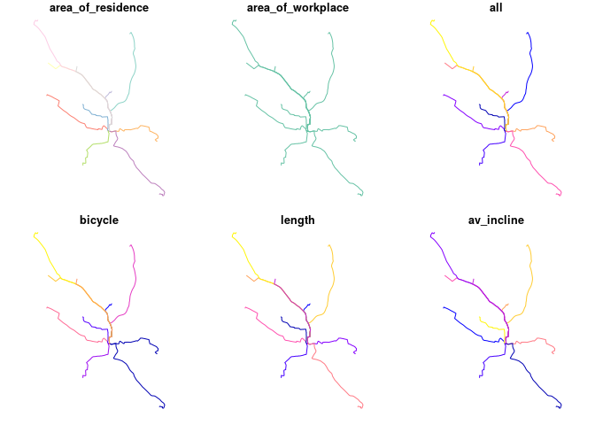
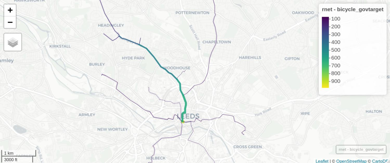

<!-- README.md is generated from README.Rmd. Please edit that file -->
pct · [](https://codecov.io/github/ITSLeeds/pct?branch=master) [](https://travis-ci.org/ITSLeeds/pct)
=====================================================================================================================================================================================================================================================================

The goal of pct is to increase the accessibility and reproducibility of the data produced by the Propensity to Cycle Tool (PCT), a research project and web application hosted at [www.pct.bike](https://www.pct.bike/). For an overview of the data provided by the PCT, clicking on the previous link and trying it out is a great place to start. An academic [paper](https://www.jtlu.org/index.php/jtlu/article/view/862) on the PCT provides detail on the motivations for and methods underlying the project.

A major motivation behind the project was making transport evidence more accessible, encouraging evidence-based transport policies. The code base underlying the PCT is publicly available (see [github.com/npct](https://github.com/npct/)). However, the code hosted there is not easy to run or reproduce, which is where this package comes in: it provides quick access to the data underlying the PCT and enables some of the key results to be reproduced quickly. It was developed primarily for educational purposes (including for upcoming PCT training courses) but it may be useful for people to build on the the methods, for example to create a scenario of cycling uptake in their town/city/region.

In summary, if you want to know how PCT works, be able to reproduce some of its results, and build scenarios of cycling uptake to inform transport policies enabling cycling in cities worldwide, this package is for you!

Installation
------------

You can install the development version of the package as follows:

``` r
remotes::install_github("ITSLeeds/pct")
```

<!-- You can install the released version of pct from [CRAN](https://CRAN.R-project.org) with: -->
<!-- ``` r -->
<!-- install.packages("pct") -->
<!-- ``` -->
Load the package as follows:

``` r
library(pct)
```

### Get PCT data

From feedback, we hear that the use of the data is critical in decision making. Therefore, one area where the package could be useful is making the data "easily" available to be processed.

-   `get_pct`: the basic function to obtain data available [here]().

The rest of these should be self explanatory.

-   `get_pct_centroids`
-   `get_pct_lines`
-   `get_pct_rnet`
-   `get_pct_routes_fast`
-   `get_pct_routes_quiet`
-   `get_pct_zones`
-   `uptake_pct_godutch`
-   `uptake_pct_govtarget`

For example, to get the centroids in West Yorkshire:

``` r
centroids = get_pct_centroids(region = "west-yorkshire")
#> Loading required package: sp
plot(centroids[, "geo_name"])
```


Likewise to download the desirelines for "west-yorkshire":

``` r
lines = get_pct_lines(region = "west-yorkshire")
plot(lines[1000:3000, c("geo_name1")])
```


``` r
# view the lines on a map
# mapview::mapview(lines[1:3000, c("geo_name1")])
```

Scenarios for Leeds
-------------------

This example shows how scenarios of cycling uptake, and how 'distance decay' works (short trips are more likely to be cycled than long trips).

The input data looks like this (origin-destination data and geographic zone data):

``` r
class(od_leeds)
#> [1] "tbl_df"     "tbl"        "data.frame"
od_leeds[c(1:3, 12)]
#>    area_of_residence area_of_workplace  all bicycle
#> 1          E02002363         E02006875  922      43
#> 2          E02002373         E02006875 1037      73
#> 3          E02002384         E02006875  966      13
#> 4          E02002385         E02006875  958      52
#> 5          E02002392         E02006875  753      19
#> 6          E02002404         E02006875 1145      10
#> 7          E02002411         E02006875  929      27
#> 8          E02006852         E02006875 1221      99
#> 9          E02006861         E02006875 1177      56
#> 10         E02006876         E02006875 1035      10
class(zones_leeds)
#> [1] "sf"         "data.frame"
zones_leeds[1:3, ]
#> Simple feature collection with 3 features and 6 fields
#> geometry type:  MULTIPOLYGON
#> dimension:      XY
#> bbox:           xmin: -1.727245 ymin: 53.90046 xmax: -1.294313 ymax: 53.94589
#> epsg (SRID):    4326
#> proj4string:    +proj=longlat +datum=WGS84 +no_defs
#>      objectid  msoa11cd  msoa11nm msoa11nmw st_areasha st_lengths
#> 2270     2270 E02002330 Leeds 001 Leeds 001    3460674  10002.983
#> 2271     2271 E02002331 Leeds 002 Leeds 002   21870986  26417.665
#> 2272     2272 E02002332 Leeds 003 Leeds 003    2811303   8586.548
#>                            geometry
#> 2270 MULTIPOLYGON (((-1.392046 5...
#> 2271 MULTIPOLYGON (((-1.340405 5...
#> 2272 MULTIPOLYGON (((-1.682211 5...
```

The `stplanr` package can be used to convert the non-geographic OD data into geographic desire lines as follows:

``` r
library(sf)
#> Linking to GEOS 3.6.1, GDAL 2.1.3, PROJ 4.9.3
desire_lines = stplanr::od2line(flow = od_leeds, zones = zones_leeds[2])
#> Warning in st_centroid.sf(zones): st_centroid assumes attributes are
#> constant over geometries of x
#> Warning in st_centroid.sfc(st_geometry(x), of_largest_polygon =
#> of_largest_polygon): st_centroid does not give correct centroids for
#> longitude/latitude data
plot(desire_lines[c(1:3, 12)])
```


We can convert these straight lines into routes with a routing service, e.g.:

``` r
routes_fast = stplanr::line2route(desire_lines, route_fun = stplanr::route_cyclestreet)
#> 10 % out of 10 distances calculated
#> 20 % out of 10 distances calculated
#> 30 % out of 10 distances calculated
#> 40 % out of 10 distances calculated
#> 50 % out of 10 distances calculated
#> 60 % out of 10 distances calculated
#> 70 % out of 10 distances calculated
#> 80 % out of 10 distances calculated
#> 90 % out of 10 distances calculated
#> 100 % out of 10 distances calculated
```

We got useful information from this routing operation. We will add the desire line data onto vital data from the routes (from a cycling uptake perspective, distance and hilliness of routes):

``` r
routes_vital = sf::st_sf(
  cbind(
  sf::st_drop_geometry(desire_lines[c(1:3, 12)]),
  sf::st_drop_geometry(routes_fast[c("length", "av_incline")]),
  geometry = routes_fast$geometry
  ))
plot(routes_vital)
```



Now we estimate cycling uptake:

``` r
routes_vital$uptake = uptake_pct_govtarget(distance = routes_vital$length, gradient = routes_vital$av_incline)
#> Distance assumed in m, switching to km
routes_vital$bicycle_govtarget = routes_vital$bicycle +
  round(routes_vital$uptake * routes_vital$all)
```

Let's see how many people started cycling:

``` r
sum(routes_vital$bicycle_govtarget) - sum(routes_vital$bicycle)
#> [1] 768
```

Nearly 1000 more people cycling to work, just in 10 desire is not bad! What % cyling is this, for those routes?

``` r
sum(routes_vital$bicycle_govtarget) / sum(routes_vital$all)
#> [1] 0.1153505
sum(routes_vital$bicycle) / sum(routes_vital$all)
#> [1] 0.03963324
```

It's gone from 4% to 11%, a realistic increase if cycling were enabled by good infrastructure and policies.

Now: where to prioritise that infrastructure and those policies?

``` r
rnet = stplanr::overline2(routes_vital, attrib = c("bicycle", "bicycle_govtarget"))
#> Loading required namespace: pbapply
#> 2019-03-13 11:40:32 constructing segments
#> 2019-03-13 11:40:32 transposing 'B to A' to 'A to B'
#> 2019-03-13 11:40:32 removing duplicates
#> 2019-03-13 11:40:32 restructuring attributes
#> 2019-03-13 11:40:32 building geometry
#> 2019-03-13 11:40:32 simplifying geometry
#> 2019-03-13 11:40:32 rejoining segments into linestrings
lwd = rnet$bicycle_govtarget / mean(rnet$bicycle_govtarget)
plot(rnet["bicycle_govtarget"], lwd = lwd)
```


We can view the results in an interactive map and share with policy makers, stakeholders, and the public! E.g. (see interactive map [here](http://rpubs.com/RobinLovelace/474074)):

``` r
mapview::mapview(rnet, zcol = "bicycle_govtarget", lwd = lwd * 2)
```



Next steps and further resources (work in progress)
---------------------------------------------------

-   Add additional scenarios of cycling uptake from different places (e.g. goCambridge)
-   Add additional distance decay functions
-   Make it easy to use data from other cities around the world
-   Show how to create raster tiles of cycling uptake
