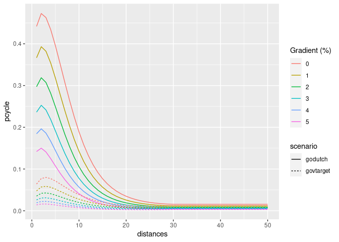
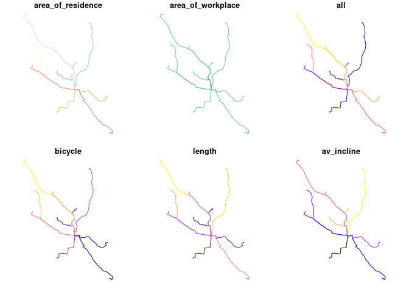
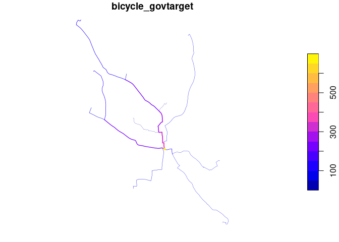

<!-- README.md is generated from README.Rmd. Please edit that file -->
<!-- badges: start -->

[](https://cran.r-project.org/package=pct)
[](https://github.com/itsleeds/pct/actions)
[](https://www.r-pkg.org/pkg/pct)
[](https://codecov.io/github/ITSLeeds/pct?branch=master)
[](https://github.com/itsleeds/pct/actions)
<!-- badges: end -->

<!-- [](https://github.com/itsleeds/pct/actions) -->
<!-- [](https://travis-ci.org/ITSLeeds/pct) -->

# pct

The goal of pct is to make the data produced by the Propensity to Cycle
Tool (PCT) easier to access and reproduce. The PCT a research project
and web application hosted at [www.pct.bike](https://www.pct.bike/). For
an overview of the data provided by the PCT, clicking on the previous
link and trying it out is a great place to start. An academic
[paper](https://www.jtlu.org/index.php/jtlu/article/view/862) on the PCT
provides detail on the motivations for and methods underlying the
project.

A major motivation behind the project was making transport evidence more
accessible, encouraging evidence-based transport policies. The code base
underlying the PCT is publicly available (see
[github.com/npct](https://github.com/npct/)). However, the code hosted
there is not easy to run or reproduce, which is where this package comes
in: it provides quick access to the data underlying the PCT and enables
some of the key results to be reproduced quickly. It was developed
primarily for educational purposes (including for upcoming PCT training
courses) but it may be useful for people to build on the the methods,
for example to create a scenario of cycling uptake in their
town/city/region.

In summary, if you want to know how PCT works, be able to reproduce some
of its results, and build scenarios of cycling uptake to inform
transport policies enabling cycling in cities worldwide, this package is
for you!

## Installation

``` r
# from CRAN
install.packages("pct")
```

You can install the development version of the package as follows:

``` r
remotes::install_github("ITSLeeds/pct")
```

Load the package as follows:

``` r
library(pct)
```

## Documentation

Probably the best place to get further information on the PCT is from
the package’s website at <https://itsleeds.github.io/pct/>

There you will find the following vignettes, which we recommend reading,
and reproducing and experimenting with the code contained within to
deepen your understanding of the code, in the following order:

1.  A ‘get started’ introduction to the PCT and associated R package:
    <https://itsleeds.github.io/pct/articles/pct.html>
2.  Getting and using PCT data, an
    [article](https://itsleeds.github.io/pct/articles/getting.html)
    showing how to get and use data from the PCT, based on a case study
    from North Yorkshire
3.  A [training
    vignette](https://itsleeds.github.io/pct/articles/pct_training.html)
    providing more detailed guidance on data provided by the PCT
    package, with interactive exercises based on a case study of the
    Isle of Wight
4.  A
    [vignette](https://itsleeds.github.io/pct/articles/cycling-potential-uk.html)
    show how to use the data provided by the package to estimate cycling
    uptake in UK cities
5.  A
    [vignette](https://itsleeds.github.io/pct/articles/pct-international.html)
    demonstrating the international applicability of the PCT method,
    with help from this and other R packages

You will also find there documentation for each of the functions at
[itsleeds.github.io/pct/reference/](https://itsleeds.github.io/pct/reference/index.html).
Below we describe some of the basics.

## Get PCT data

From feedback, we hear that the use of the data is critical in decision
making. Therefore, one area where the package could be useful is making
the data “easily” available to be processed.

-   `get_pct`: the basic function to obtain data available
    [here](https://itsleeds.github.io/pct/reference/get_pct.html).

The rest of these should be self explanatory.

-   `get_pct_centroids`
-   `get_pct_lines`
-   `get_pct_rnet`
-   `get_pct_routes_fast`
-   `get_pct_routes_quiet`
-   `get_pct_zones`
-   `uptake_pct_godutch`
-   `uptake_pct_govtarget`

For example, to get the centroids in West Yorkshire:

``` r
centroids = get_pct_centroids(region = "west-yorkshire")
plot(centroids[, "geo_name"])
```


Likewise to download the desire lines for “west-yorkshire”:

``` r
lines = get_pct_lines(region = "west-yorkshire")
lines = lines[order(lines$all, decreasing = TRUE), c("all")]
plot(lines[1:10,], lwd = 4)
```


``` r
# view the lines on a map
# mapview::mapview(lines[1:3000, c("geo_name1")])
```

## Estimate cycling uptake

An important part of the PCT is its ability to create model scenarios of
cycling uptake. Key to the PCT uptake model is ‘distance decay’, meaning
that short trips are more likely to be cycled than long trips. The
functions `uptake_pct_govtarget()` and `uptake_pct_godutch()` implement
uptake models used in the PCT, which use distance and hilliness per
desire line as inputs and output the proportion of people who could be
expected to cycle if that scenario were realised. The scenarios of
cycling uptake produced by these functions are not predictions of what
*will* happen, but illustrative snapshots of what *could* happen if
overall propensity to cycle reached a certain level. The uptake levels
produced by Go Dutch and Government Target scenarios (which represent
increases in cycling, not final levels) are illustrated in the graph
below (other scenarios could be produced, see the [source
code](https://itsleeds.github.io/pct/reference/uptake_pct_govtarget.html)
see how these models work):

``` r
distances = 1:20
hilliness = 0:5
uptake_df = data.frame(
  distances = rep(distances, 6),
  hilliness = rep(hilliness, each = 20)
)
p_govtarget = uptake_pct_govtarget(
    distance = uptake_df$distances,
    gradient = uptake_df$hilliness
    )
p_godutch = uptake_pct_godutch(
    distance = uptake_df$distances,
    gradient = uptake_df$hilliness
    )
uptake_df = rbind(
  cbind(uptake_df, scenario = "govtarget", pcycle = p_govtarget),
  cbind(uptake_df, scenario = "godutch", pcycle = p_godutch)
)
library(ggplot2)
ggplot(uptake_df) +
  geom_line(aes(
    distances,
    pcycle,
    linetype = scenario,
    colour = as.character(hilliness)
  )) +
  scale_color_discrete("Gradient (%)")
```



The proportion of trips made by cycling along each origin-destination
(OD) pair therefore depends on the trip distance and hilliness. The
equivalent plot for hilliness is as follows:

``` r
distances = c(1, 3, 6, 10, 15, 21)
hilliness = seq(0, 10, by = 0.2)
uptake_df = 
  data.frame(
    expand.grid(distances, hilliness)
  )
names(uptake_df) = c("distances", "hilliness")
p_govtarget = uptake_pct_govtarget(
    distance = uptake_df$distances,
    gradient = uptake_df$hilliness
    )
p_godutch = uptake_pct_godutch(
    distance = uptake_df$distances,
    gradient = uptake_df$hilliness
    )
uptake_df = rbind(
  cbind(uptake_df, scenario = "govtarget", pcycle = p_govtarget),
  cbind(uptake_df, scenario = "godutch", pcycle = p_godutch)
)
ggplot(uptake_df) +
  geom_line(aes(
    hilliness,
    pcycle,
    linetype = scenario,
    colour = formatC(distances, flag = "0", width = 2)
  )) +
  scale_color_discrete("Distance (km)")
```


Note: if distances or gradient values appear to be provided in incorrect
units, they will automatically be updated:

``` r
distances = uptake_df$distances * 1000
hilliness = uptake_df$hilliness / 100
res = uptake_pct_godutch(distances, hilliness, verbose = TRUE)
#> Distance assumed in m, switching to km
#> Gradient assumed to be gradient, switching to % (*100)
```

The main input dataset into the PCT is OD data and, to convert each OD
pair into a geographic desire line, geographic zone or centroids.
Typical input data is provided in packaged datasets `od_leeds` and
`zones_leeds`, as shown in the next section.

## Reproduce PCT for Leeds

This example shows how scenarios of cycling uptake, and how ‘distance
decay’ works (short trips are more likely to be cycled than long trips).

The input data looks like this (origin-destination data and geographic
zone data):

``` r
class(od_leeds)
#> [1] "tbl_df"     "tbl"        "data.frame"
od_leeds[c(1:3, 12)]
#> # A tibble: 10 × 4
#>    area_of_residence area_of_workplace   all bicycle
#>    <chr>             <chr>             <dbl>   <dbl>
#>  1 E02002363         E02006875           922      43
#>  2 E02002373         E02006875          1037      73
#>  3 E02002384         E02006875           966      13
#>  4 E02002385         E02006875           958      52
#>  5 E02002392         E02006875           753      19
#>  6 E02002404         E02006875          1145      10
#>  7 E02002411         E02006875           929      27
#>  8 E02006852         E02006875          1221      99
#>  9 E02006861         E02006875          1177      56
#> 10 E02006876         E02006875          1035      10
class(zones_leeds)
#> [1] "sf"         "data.frame"
zones_leeds[1:3, ]
#> old-style crs object detected; please recreate object with a recent sf::st_crs()
#> old-style crs object detected; please recreate object with a recent sf::st_crs()
#> Simple feature collection with 3 features and 6 fields
#> Geometry type: MULTIPOLYGON
#> Dimension:     XY
#> Bounding box:  xmin: -1.727245 ymin: 53.90046 xmax: -1.294313 ymax: 53.94589
#> Geodetic CRS:  WGS 84
#>      objectid  msoa11cd  msoa11nm msoa11nmw st_areasha st_lengths
#> 2270     2270 E02002330 Leeds 001 Leeds 001    3460674  10002.983
#> 2271     2271 E02002331 Leeds 002 Leeds 002   21870986  26417.665
#> 2272     2272 E02002332 Leeds 003 Leeds 003    2811303   8586.548
#>                            geometry
#> 2270 MULTIPOLYGON (((-1.392046 5...
#> 2271 MULTIPOLYGON (((-1.340405 5...
#> 2272 MULTIPOLYGON (((-1.682211 5...
```

The `stplanr` package can be used to convert the non-geographic OD data
into geographic desire lines as follows:

``` r
library(sf)
#> Linking to GEOS 3.9.1, GDAL 3.3.2, PROJ 7.2.1
desire_lines = stplanr::od2line(flow = od_leeds, zones = zones_leeds[2])
#> Creating centroids representing desire line start and end points.
#> old-style crs object detected; please recreate object with a recent sf::st_crs()
#> old-style crs object detected; please recreate object with a recent sf::st_crs()
#> old-style crs object detected; please recreate object with a recent sf::st_crs()
#> old-style crs object detected; please recreate object with a recent sf::st_crs()
#> old-style crs object detected; please recreate object with a recent sf::st_crs()
#> old-style crs object detected; please recreate object with a recent sf::st_crs()
plot(desire_lines[c(1:3, 12)])
```


We can convert these straight lines into routes with a routing service,
e.g.:

``` r
segments_fast = stplanr::route(l = desire_lines, route_fun = cyclestreets::journey)
#> Most common output is sf
```

We got useful information from this routing operation, we will convert
the route segments into complete routes with `dplyr`:

``` r
library(dplyr)
#> 
#> Attaching package: 'dplyr'
#> The following objects are masked from 'package:stats':
#> 
#>     filter, lag
#> The following objects are masked from 'package:base':
#> 
#>     intersect, setdiff, setequal, union
routes_fast = segments_fast %>% 
  group_by(area_of_residence, area_of_workplace) %>% 
  summarise(
    all = unique(all),
    bicycle = unique(bicycle),
    length = sum(distances),
    av_incline = mean(gradient_smooth) * 100
  ) 
#> `summarise()` has grouped output by 'area_of_residence'. You can override using the `.groups` argument.
```

The results at the route level are as follows:

``` r
plot(routes_fast)
```



Now we estimate cycling uptake:

``` r
routes_fast$uptake = uptake_pct_govtarget(distance = routes_fast$length, gradient = routes_fast$av_incline)
routes_fast$bicycle_govtarget = routes_fast$bicycle +
  round(routes_fast$uptake * routes_fast$all)
```

Let’s see how many people started cycling:

``` r
sum(routes_fast$bicycle_govtarget) - sum(routes_fast$bicycle)
#> [1] 404
```

Nearly 1000 more people cycling to work, just in 10 desire is not bad!
What % cycling is this, for those routes?

``` r
sum(routes_fast$bicycle_govtarget) / sum(routes_fast$all)
#> [1] 0.07946367
sum(routes_fast$bicycle) / sum(routes_fast$all)
#> [1] 0.03963324
```

It’s gone from 4% to 11%, a realistic increase if cycling were enabled
by good infrastructure and policies.

Now: where to prioritise that infrastructure and those policies?

``` r
routes_fast_linestrings = sf::st_cast(routes_fast, "LINESTRING")
rnet = stplanr::overline(routes_fast_linestrings, attrib = c("bicycle", "bicycle_govtarget"))
lwd = rnet$bicycle_govtarget / mean(rnet$bicycle_govtarget)
plot(rnet["bicycle_govtarget"], lwd = lwd)
```



We can view the results in an interactive map and share with policy
makers, stakeholders, and the public! E.g. (see interactive map
[here](https://rpubs.com/RobinLovelace/474074)):

``` r
mapview::mapview(rnet, zcol = "bicycle_govtarget", lwd = lwd * 2)
```


## Current limitations

-   This package does not contain code to estimate cycling uptake
    associated with intrazonal flows and people with no fixed job data,
    although the datasets downloaded with the `get_pct_centroids()`
    functions provide estimated uptake for intrazonal flows.
-   This package currently does not contiain code to estimate health
    benefits

<!-- Commented out as we have now immediate plans to work on these -->
<!-- ## Next steps and further resources -->
<!-- - Add additional scenarios of cycling uptake from different places (e.g. goCambridge) -->
<!-- - Add additional distance decay functions -->
<!-- - Make it easy to use data from other cities around the world -->
<!-- - Show how to create raster tiles of cycling uptake -->
