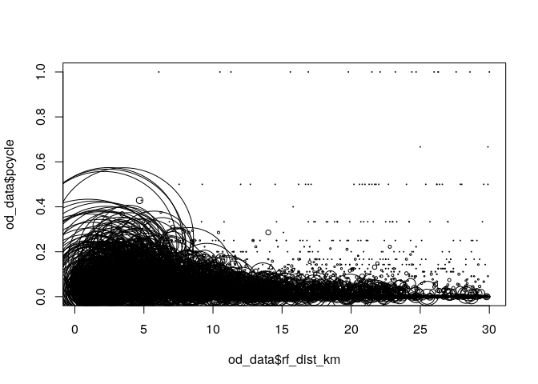
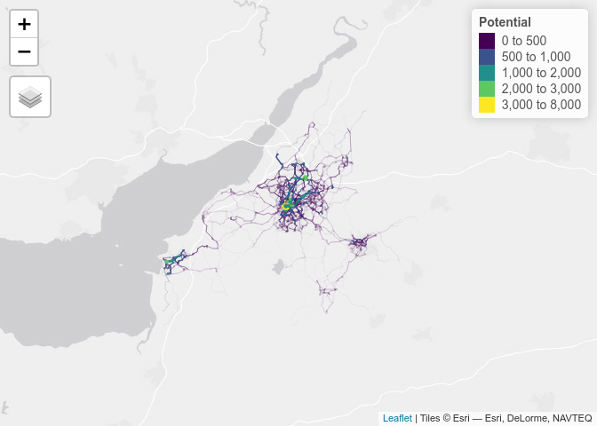

Dear Propensity to Cycle Tool Advanced Workshop Participant,

I am looking forward to the event this Thursday and wanted to share with
you a few links and reminders beforehand.

The first thing to say is that this is an **Advanced Workshop** based on
the **statistical programming language R** so you will be expected to
run code in R/RStudio. You will be expected to ‘get you hands dirty’ and
write some code so it’s important that you have your computer set-up and
ready to before the course starts. To check that R is working on your
computer, please ensure that you can run the entirety of this script in
RStudio: <https://github.com/ITSLeeds/pct/blob/master/inst/test-setup.R>

If you see this plot appear after running line 14 (shown below - see
this in context in the link above), congratulations on getting a basic R
set-up working.

``` r
plot(od_data$rf_dist_km, od_data$pcycle, cex = od_data$all / mean(od_data$all))
```

<!-- -->

After running the lines from 15 onwards you should see a number of plots
and other outputs. The following line of code should, after running all
the code in the link above, tell you the average number of cyclists on
route network segments in Avon under the PCT’s Go Dutch scenario:

``` r
round(mean(rnet_potential$Potential))
```

What number did you get? We will test you during the course so make sure
you try to reproduce the result. A more visual check that your computer
is set-up to do transport data science with R for modelling cycling
uptake is plotting the result. If you got the plot shown below after
running the following
[code](https://github.com/ITSLeeds/pct/blob/8fb7b876a3b372c728c8e09f1a2a2004272b37d0/inst/test-setup.R#L59-L60)
(you will need to have run all previous lines), congratulations, you’re
ready to go!

``` r
tm_shape(rnet_potential) +
  tm_lines(lwd = "Potential", scale = 9, col = "Potential", palette = "viridis", breaks = b)
```

    ## Legend for line widths not available in view mode.

<!-- -->

If you have any issues reproducing the code, please double check your R
install and make sure you have installed the necessary.

You will need to have a recent version of R and RStudio installed.
Double check you have at least R 4.0.0 and RStudio 1.2 installed. If
not, [**ensure that you have the latest versions
installed**](https://rstudio-education.github.io/hopr/starting.html).

If you have any issues, please open an issue here:
<https://github.com/ITSLeeds/pct/issues> (As a last resort you can email
at <r.lovelace@leeds.ac.uk> although I may not be able to respond before
the event).

The second thing to say is that having a GitHub account will help you
ask questions and share reproducible examples, so please sign-up if you
have not yet registered: <https://github.com>

After you have signed-up, please check it works by saying hi on this
issue (we will also use this link to answer code related questions
during the course): <https://github.com/ITSLeeds/pct/issues/74>

The **third thing is about routing.** If you want to do routing on the
network, please sign-up at <https://www.cyclestreets.net/api/apply/>.
You should save the resulting key on your system by running the
following commands:

``` r
# uncomment these lines to install cyclestreets
# install.packages("usethis")
# install.packages("cyclestreets")
usethis::edit_r_environ()
```

Then add the following line to the file that pops up:

    CYCLESTREETS=ca43ed677e5e6fe1

For more info on testing if this worked, see:

The fourth and final thing to say: please ensure that you have at least
taken a read of (and ideally have reproduced some of the code examples
in) these links:

-   The original paper on the Propensity to Cycle Tool:
    <https://www.jtlu.org/index.php/jtlu/article/view/862>
-   The transport chapter
    ([12](https://geocompr.robinlovelace.net/transport.html)) in the
    open source book [*Geocomputation with
    R*](https://geocompr.robinlovelace.net/)
    \[@lovelace\_geocomputation\_2019\]
-   The vignette that describes the pct R package, which can be found
    here: <https://itsleeds.github.io/pct/articles/pct.html>
-   Information on how to create reproducible examples (this will be
    useful when asking for help during the workshop):
    <https://reprex.tidyverse.org/>

Hope this is useful, please prioritise getting R up-and-running and let
us know if you have any issues.

All the best,

Robin

P.s. there is one more thing to say: we plan a virtual ‘to the pub’
session after the event from 5pm to 6pm so make sure you have beer (or
whatever refreshment takes your fancy) in stock if you want to join for
a post workshop social.
